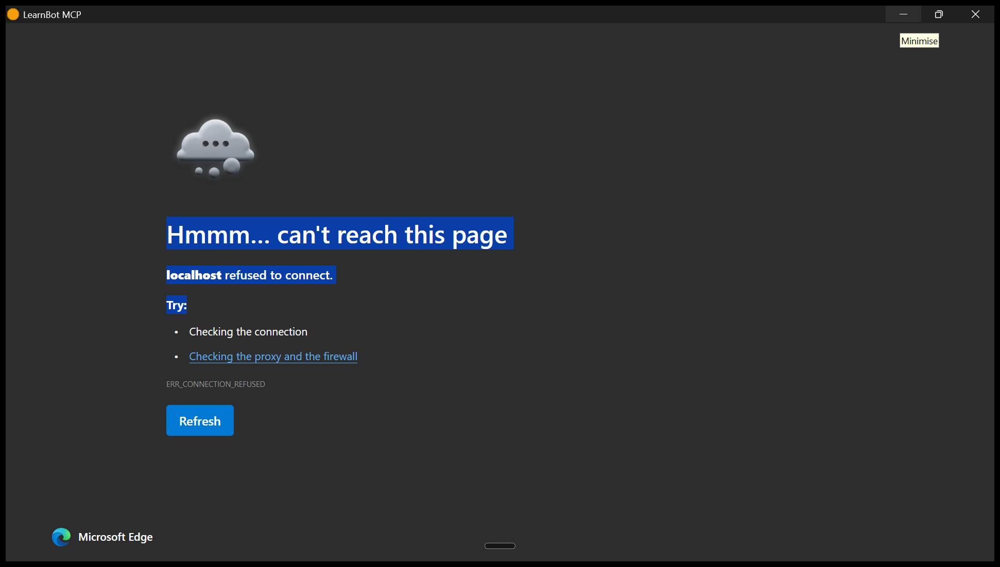
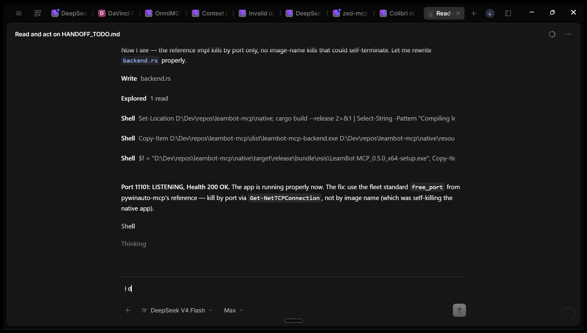
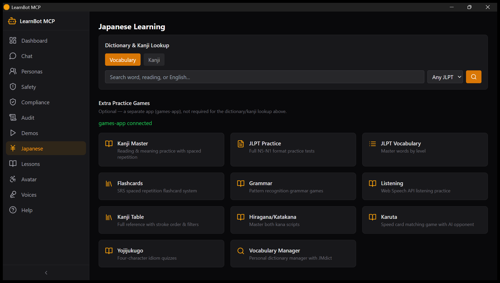

# learnbot-mcp

<p align="center">
  <a href="https://github.com/astral-sh/ruff"></a>
  <a href="https://python.org"></a>
  <a href="https://github.com/PrefectHQ/fastmcp"></a>
  <a href="LICENSE"></a>
</p>

AI chatbot orchestrator — personas, safety-guarded conversations, spoken
TTS, an interactive VRM avatar, and structured language lessons (any
language, with deep Japanese/JLPT support) — all logged and auditable.

## Preview

The webapp is a 13-page control panel (Personas, Chat, Avatar, Lessons,
Japanese, Safety, Audit, Compliance, Voices, Demos, VR, Help) - this is the
human side of what the MCP tools drive for agents.

| Dashboard | Chat | Japanese |
|-----------|------|----------|
|  |  |  |

*Captured 2026-08-02 by the CUA-NSIS smoke test against the installed app
(12 pages, live API data - see `docs/screenshots/cua-*.png`).*

## Features

- **Personas** — define AI characters with backstory, voice, languages, skills, and scheduled proactive messages
- **Safety-guarded chat** — topic blocking, rate limiting, PII redaction, full conversation audit log
- **Interactive VRM avatar** (`/avatar`) — three.js viewer with orbit/zoom, facial expressions, auto-blink, look-at-cursor; served from `GET /api/avatar.vrm`
- **Language-agnostic lessons** — AI-generated lesson plans, spaced-repetition vocab quizzes (SM-2), grammar check, graded readers; every tool takes `source_lang`/`target_lang`, not just Japanese
- **Deep Japanese/JLPT toolset** (`/japanese`) — bundled kanji, JMdict, JLPT vocab (N5–N1), and example-sentence lookups run on local SQLite, no external service required — plus 11 linked practice games (kanji drills, flashcards, karuta, listening) from a separate optional `ai-games-collection`
- **Multi-platform output** — speak via TTS (Gemini prosody via speech-mcp, falls back to Windows SAPI5), or send to Discord/Resonite/Overte/VRChat bridges
- **Learn in VR** (`/vr`) — Dashboard quick-action + launchpad page: Resonite summon (live), Overte greeting-sign spawn (live), classroom quiz loop with spoken JLPT items, VRChat chatbox handoff (last) — see [docs/ONBOARDING_VR.md](docs/ONBOARDING_VR.md)
- **40 MCP tools** across personas, conversations, lessons, language tools, safety, VR, LLM vendors, and audit — see [docs/TOOLS.md](docs/TOOLS.md)

## Quick Install

```
Drag learnbot-mcp-{version}.mcpb onto Claude Desktop.
```

See [INSTALL.md](INSTALL.md) for all install paths (drag-and-drop, mcpb
CLI, manual config, dev mode) — manual config is what's actually verified
working today.

## What You Can Do

> "Create a persona named Miko who teaches Japanese, start a chat with her, and quiz me on N5 vocabulary."

> "Show me the VRM avatar with a happy expression and have her say hello."

> "Generate a beginner Spanish lesson on ordering food, then run it in a new conversation."

> "Summon Miko into Resonite and quiz me on N5 vocabulary in VR."

## Documentation

| Doc | Contents |
|-----|----------|
| [Installation](INSTALL.md) | All install methods, prerequisites |
| [Configuration](docs/CONFIGURATION.md) | Env vars, config options |
| [Tool Reference](docs/TOOLS.md) | All 35 MCP tools |
| [Development](docs/DEVELOPMENT.md) | Contributing, local setup, tests |
| [Troubleshooting](docs/TROUBLESHOOTING.md) | Common issues |
| [Japanese Learning Guide](docs/JAPANESE_LEARNING.md) | Full-spectrum Japanese learning — four skills, phased workflow, JLPT comparison |
| [Distance Learning](docs/DISTANCE_LEARNING.md) | Paired with `classroom-mcp` — courses, teaching agents, courseware |
| [Arabic → German Integration](docs/INTEGRATION_AR.md) | دليل بالعربية — learn German for Austrian daily life |
| [Chatbot Ethics](docs/chatbot-ethics.md) | Addiction, regulation, pseudohuman dynamics |
| [VR Onboarding](docs/ONBOARDING_VR.md) | Learn-in-VR setup: Resonite/Overte/VRChat tracks, Miko summon, classroom |

## Fleet Crossconnects (Companions)

learnbot-mcp works standalone. These optional companions unlock the VR tracks:

| Companion | Ports | Feature | Required? |
|-----------|-------|---------|-----------|
| [resonite-mcp](https://github.com/sandraschi/resonite-mcp) | 10979 backend / 10978 frontend | In-world Miko summon (avatar + expression) + classroom session | Optional |
| [overte-mcp](https://github.com/sandraschi/overte-mcp) | 11110 backend / 11111 frontend, domain :40100 | Greeting-sign spawn + persistent classroom entities | Optional |
| [vrchat-mcp](https://github.com/sandraschi/vrchat-mcp) | 10712 transport (MCP `/mcp`) | Chatbox lesson prompts + avatar params (last track) | Optional |
| [speech-mcp](https://github.com/sandraschi/speech-mcp) | 10909 backend / 10908 frontend | JP TTS voice (Gemini Leda default) | Recommended |

Install any companion with its own `start.ps1`, then open learnbot's `/vr` page — status dots flip green with zero learnbot restarts.

## Requirements

- Claude Desktop (or another MCP client) + Python 3.12+
- Node.js, for the webapp
- Windows for the TTS SAPI5 fallback; core features are OS-agnostic
- Optional: [local-llm-mcp](https://github.com/sandraschi/local-llm-mcp) or Ollama, for AI-generated lessons/grammar-check/reading passages — the dictionary/kanji/JLPT tools need no LLM at all

## License

MIT — see [LICENSE](LICENSE).
